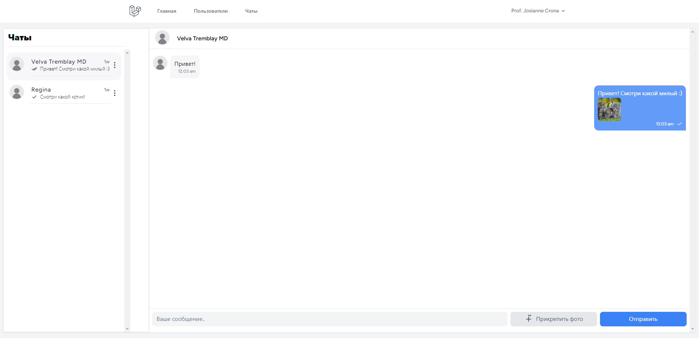
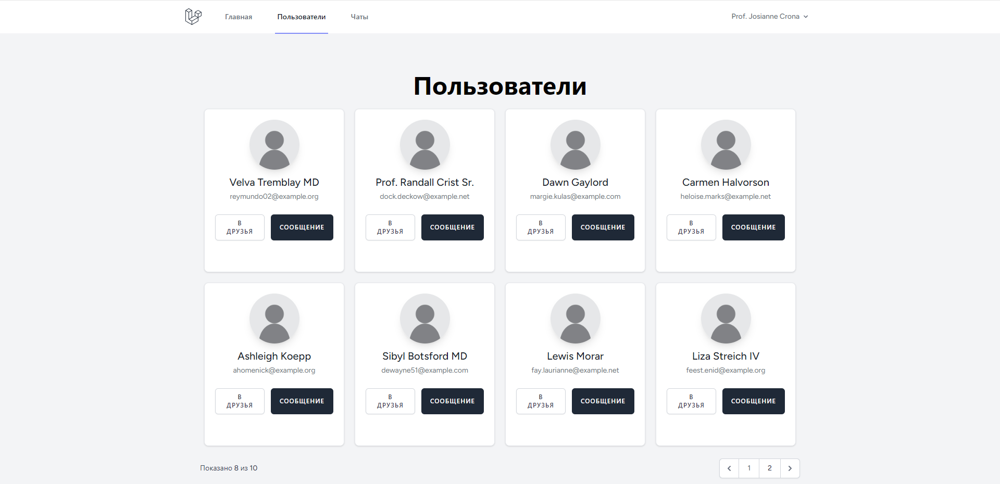
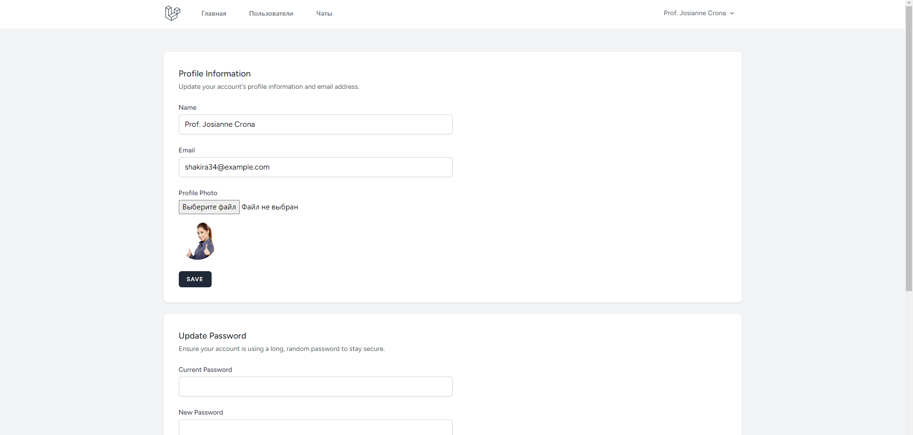
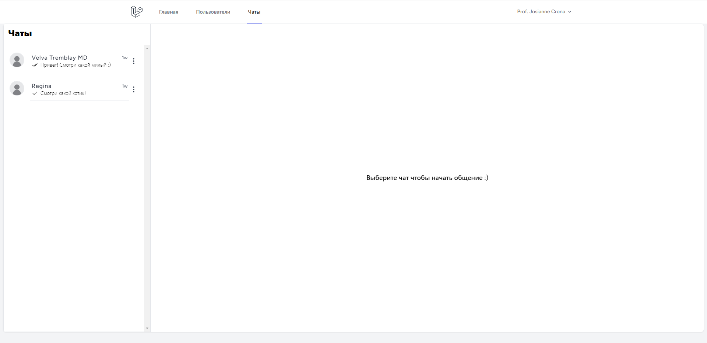

<h1 align="center">Мессенджер на Laravel</h1>

    

<a name="summary">
  

    
Оглавление

    <ol>
      <li><a href="#project-description">Описание проекта</a></li>
      <li><a href="#technologies">Стек технологий</a></li>
      <li><a href="#installation">Установка и запуск приложения в локальном репозитории</a></li>
      <li><a href="#functionality">Функционал</a></li>
    </ol>
  

</a>

<a name="project-description"><h2>О проекте</h2></a>
Приложение для общения с возможностью делиться фото (буду дополнять по мере возможности функционал)

<b>Фото проекта:</b>
 

<a name="technologies"><h2>Стек технологий</h2></a>

	<code></code>

<a name="installation"><h2>Установка и запуск</h2></a>
1. `git clone` - клонировать репозиторий на свое устройство (HTTPS)
2. `npm i` - установить зависимости
3. `php artisan serve` - запустить сервер
4. `npm run dev` - запустить приложение
5. `php artisan queue:work` - запускаем очередь задач

<a name="functionality"><h2>Функционал</h2></a>
- Регистрация и авторизация пользователя
- Изменения данных о пользователе в профиле
- Создание чата между двумя пользователями
- Отправка текстовых и графических изображений 
- Удаление переписки (Только у себя или у обоих)
- Получение сообщения в режиме реального времени, а также отметки "Прочитано\Доставлено"
